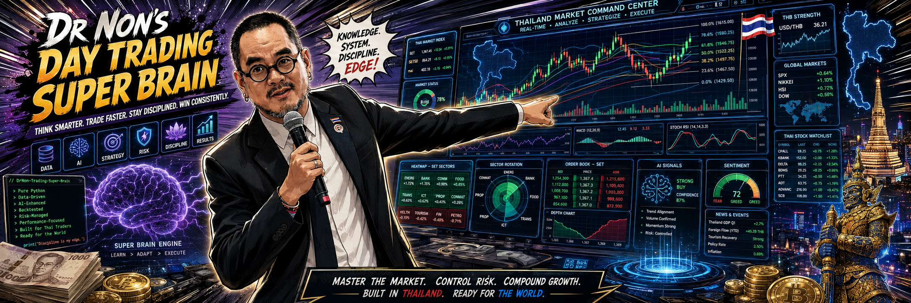

<div align="center">

<!-- Save the hero image as: public/assets/hero.png -->


</div>

<br>

<div align="center">

```
KNOWLEDGE  ·  SYSTEM  ·  DISCIPLINE  ·  EDGE
```

**SIAM MARKETS** is a market intelligence platform built for Thai retail investors and traders.  
It doesn't just show you data — it puts different data sets on the same axis, so your brain can connect dots that spreadsheets can't.

[](https://nonarkara.org)
[](https://nextjs.org)
[](https://pages.cloudflare.com)
[](#)

</div>

---

## The Core Problem

Most dashboards show you one thing at a time.

Price on one screen. Macro on another. Sentiment buried in a news feed. Regional markets in a separate tab. The human brain can't connect data that isn't physically on the same surface at the same time.

**SIAM MARKETS puts everything on the same axis.**

When the US Fed rate moves — you see the SET reaction, the THB response, and the Fear & Greed shift simultaneously. When China markets fall 2% before Bangkok opens — you see it next to the SET historical reaction pattern. When the BOT holds the policy rate — you see the lending rate band it's operating inside, alongside the sector that benefits most.

That's the edge. Not the data. The **co-visualization**.

---

## What's On The Same Axis

```
┌─────────────────────────────────────────────────────────────────┐
│  SET INDEX + ASEAN PEERS + CHINA + US — one regional grid       │
│  ─────────────────────────────────────────────────────────────  │
│  Price action + EMA 9/21 + VWAP + Bollinger Bands              │
│  ─────────────────────────────────────────────────────────────  │
│  RSI + MACD + market regime — below every chart                 │
│  ─────────────────────────────────────────────────────────────  │
│  World events (GDELT) timestamped against price moves          │
│  ─────────────────────────────────────────────────────────────  │
│  Fear & Greed (0–100) as a persistent overlay signal           │
│  ─────────────────────────────────────────────────────────────  │
│  Graham Number vs. Current Price — the value gap visualized    │
│  ─────────────────────────────────────────────────────────────  │
│  US Fed rate + Thai BOT rate + THB/USD — macro in one strip    │
└─────────────────────────────────────────────────────────────────┘
```

This is not a dashboard. It's a **correlation engine with a visual front end**.

---

## Five Views

<table>
<tr>
<td width="20%" align="center"><strong>PULSE</strong></td>
<td>Live SET · ASEAN · China · US indices on one screen. Fear & Greed dial. Real Fed rate from FRED. Real THB/USD. Mr Market's mood — stated plainly.</td>
</tr>
<tr>
<td align="center"><strong>TRADE DESK</strong></td>
<td>Technical readout: EMA 9/21, RSI, MACD, VWAP, Bollinger. Market regime detection. Support &amp; resistance zones with touch counts. Signal confidence score 0–100. Position sizer: account size + risk % → exact shares, notional, R:R.</td>
</tr>
<tr>
<td align="center"><strong>SIMULATOR</strong></td>
<td>Paper trading with journaling enforced. Performance metrics: win rate, profit factor, max drawdown, Sharpe. The 1% rule coach — triggered when your stats reveal bad habits.</td>
</tr>
<tr>
<td align="center"><strong>SCANNER</strong></td>
<td>SET50 screened through Graham/Buffett criteria. Graham Number vs. price. Margin of safety %. P/E · P/B · ROE · D/E. Defensive score 0–7. Buffett quality score 0–10. Sorted by margin of safety descending.</td>
</tr>
<tr>
<td align="center"><strong>SCHOOL</strong></td>
<td>11 concept cards. Not tutorials — live signals wired into each concept. "SET P/E today: 15.4 — Graham says fair value." Fear &amp; Greed score as Buffett's buying/selling indicator. Today's regime mapped to the relevant lesson.</td>
</tr>
</table>

---

## The Two-Brain Architecture

This is how professional traders actually operate — not a choice between fundamentals and technicals, but a sequence:

```
WHAT to trade          ──→  Graham / Buffett filter
                              P/E < 15, P/B < 1.5, ROE > 15%
                              Graham Number > Price
                              Moat: wide or narrow
                              ↓
WHEN to trade          ──→  Technical confirmation
                              Regime: trending (not ranging)
                              RSI: not overbought
                              Price: at or near S/R zone
                              Signal confidence: > 60
                              ↓
HOW MUCH to risk       ──→  Position sizer
                              Account × 1% max risk
                              Entry − Stop = risk per share
                              Shares = (Account × 0.01) / risk/share
```

Neither brain works alone. The Graham filter prevents you from technically trading garbage. The technical filter prevents you from fundamentally buying at the wrong time.

---

## Correlation Signals Built Into The System

The value is in what gets put **side by side** — data that usually lives in separate applications:

| Signal A | Signal B | What It Reveals |
|---|---|---|
| SET daily % change | GDELT news sentiment | Which headlines actually moved the market vs. noise |
| S&P 500 close | SET next-day open | Overnight correlation: how much the US exported |
| Shanghai Composite | Thai China-fund inflows | China proxy: Thai retail investor exposure |
| BOT policy rate | Thai lending stocks (KBANK, SCB, BBL) | Rate-cycle positioning |
| Fear & Greed (0–25) | SET forward returns | Buffett's buying window — historically +40% over 90 days |
| EMA 9 vs EMA 21 crossover | Volume | Confirming vs. false breakouts |
| Graham Number gap | Price | How far a stock is from its calculated ceiling |
| Market regime | Position size allowed | Trend = full size. Range = half size. |

---

## Data Sources

All free. All live. No paid subscriptions required.

```
┌──────────────────────┬─────────────────────────────────┬──────────────┐
│ Source               │ Data                            │ Update       │
├──────────────────────┼─────────────────────────────────┼──────────────┤
│ Yahoo Finance API    │ SET · KLSE · JKSE · STI · TWII  │ Live (5 min) │
│                      │ Shanghai · CSI 300 · Hang Seng  │              │
├──────────────────────┼─────────────────────────────────┼──────────────┤
│ FMP (free tier)      │ S&P 500 · Nikkei · Nasdaq       │ Live (5 min) │
│                      │ Fundamentals: P/E, P/B, ROE     │ Daily        │
├──────────────────────┼─────────────────────────────────┼──────────────┤
│ FRED API             │ Fed funds rate · US CPI         │ Daily        │
│                      │ 10Y Treasury · Unemployment     │              │
├──────────────────────┼─────────────────────────────────┼──────────────┤
│ FearGreedChart.com   │ Fear & Greed Index (0–100)      │ Live         │
├──────────────────────┼─────────────────────────────────┼──────────────┤
│ Bank of Thailand API │ THB/USD · Policy rate · MLR     │ Daily        │
├──────────────────────┼─────────────────────────────────┼──────────────┤
│ GDELT Project        │ World events + sentiment score  │ 15 min       │
├──────────────────────┼─────────────────────────────────┼──────────────┤
│ World Bank API       │ Thai GDP growth · Inflation     │ Monthly      │
└──────────────────────┴─────────────────────────────────┴──────────────┘
```

---

## Technical Analysis Engine

Pure TypeScript — zero external TA libraries. Fully testable, no C bindings.

```typescript
// All of these run server-side on every /trade request
ema(prices, 9)              // fast line
ema(prices, 21)             // slow line
rsi(prices, 14)             // momentum — overbought > 70, oversold < 30
macd(prices, 12, 26, 9)     // trend direction + histogram
bollingerBands(prices, 20)  // volatility envelope
vwap(ohlcv)                 // institutional price level
atr(ohlcv, 14)              // volatility for stop placement
findSupportResistance(ohlcv) // zones with touch counts + strength
detectRegime(prices, atr)    // trending_up / trending_down / ranging / high_volatility
detectPattern(ohlcv)         // doji / hammer / shooting_star / engulfing / inside_bar
generateSignal(all_above)    // 0–100 confidence score with reason list
```

---

## Graham / Buffett Calculation Layer

```typescript
// src/lib/graham.ts — pure functions, all testable

grahamNumber(eps, bvps)            // √(22.5 × EPS × BVPS) — fair value ceiling
marginOfSafety(price, grahamNum)   // (GN − Price) / GN × 100 — the safety gap
defensiveScore(criteria)           // 0–7: Graham's 7 criteria for conservative investors
buffettScore(criteria)             // 0–10: ROE consistency, debt, FCF, gross margin
calcThaiTax(income, rmf, esg, ssf) // RMF + ThaiESG + SSF → exact THB tax saved
tenYearProjection(lump, monthly)   // compound at 6% / 8% / 10% — patience visualized
```

---

## Design System

```
Background     #0d0d0d   ████  near-black
Surface        #1e1e1e   ████  card background
Line           #2a2a2a   ████  hairline borders — 1px only
Ink            #e8e8e8   ████  primary text

Bull / Gain    #00c896   ████  emerald — buy signal, positive
Bear / Loss    #ff3b30   ████  Apple red — sell signal, negative
Caution        #ff9500   ████  amber — watch, neutral
Chrome         #007aff   ████  blue — UI, links

Display type   Josefin Sans        — titles, hero numbers
Body type      Source Sans 3       — labels, captions, data
Mono type      IBM Plex Mono       — all numeric values, tickers

Border radius  0px — always       — no rounded corners, no exceptions
Shadows        none               — hairline borders only
Gradients      none               — solid fills only
```

Zero `border-radius`. Every element is a rectangle. Every number is monospaced. The contrast between background and data is the entire visual language.

---

## Stack

```
Next.js 16.2     App Router · Server Components · ISR (5-min revalidation)
React 19         Concurrent features
TypeScript 5     Strict mode — zero `any`
Tailwind CSS v4  Design tokens only — no utility class soup
Framer Motion    Page entry animations — 400ms, ease-out only
Supabase         PostgreSQL cache for ingested price/fundamental data
Cloudflare Pages Edge deployment — Workers for dynamic API routes
```

---

## Quick Start

```bash
git clone https://github.com/nonarkara/siam-markets
cd siam-markets
npm install
cp .env.local.example .env.local   # add your free API keys
npm run dev                         # → http://localhost:3000
```

The app runs fully on **mock data with zero API keys**. Every page, every chart, every signal. Add keys progressively to replace mock data with live feeds.

```bash
# Free API keys (all no-credit-card required)
# FMP:  financialmodelingprep.com/developer/docs
# FRED: fredaccount.stlouisfed.org/apikeys
# BOT:  portal.api.bot.or.th
```

---

## Ingestion (Live Thai Data)

```bash
pip install yfinance supabase requests
npm run ingest:prices        # SET50 daily OHLCV → Supabase
npm run ingest:fundamentals  # P/E, P/B, ROE, Graham Number → Supabase
npm run ingest:macro         # FRED + World Bank → Supabase
```

Schedule with cron after SET closes (16:30 Bangkok, UTC+7):

```
30 9 * * 1-5   cd /path/to/siam-markets && npm run ingest:prices
30 9 * * 1-5   cd /path/to/siam-markets && npm run ingest:fundamentals
0  10 * * 1    cd /path/to/siam-markets && npm run ingest:macro
```

---

## Repository Structure

```
siam-markets/
├── src/
│   ├── app/
│   │   ├── page.tsx            Market Pulse — live SET + regional + macro
│   │   ├── trade/              Trade Desk — TA + signal + position sizer
│   │   ├── simulate/           Paper Trading Simulator
│   │   ├── scanner/            Value Scanner — Graham/Buffett SET50
│   │   ├── school/             Investment School — 11 concepts, live signals
│   │   └── api/
│   │       ├── pulse/          Live market data aggregation
│   │       ├── technical/      TA engine endpoint
│   │       ├── scanner/        Fundamental screener
│   │       ├── events/         GDELT world events
│   │       └── macro/          FRED + World Bank indicators
│   ├── lib/
│   │   ├── graham.ts           Graham/Buffett/Munger calculations
│   │   ├── technical.ts        EMA, RSI, MACD, BB, VWAP, S/R, signal
│   │   ├── trading.ts          Paper trading — portfolio, metrics, 1% rule
│   │   ├── types.ts            All TypeScript interfaces
│   │   ├── format.ts           Number/currency formatting
│   │   └── api/
│   │       ├── yahoo.ts        SET + ASEAN + China (no key)
│   │       ├── fmp.ts          Global indices + fundamentals
│   │       ├── fred.ts         US macro indicators
│   │       ├── bot.ts          Bank of Thailand rates
│   │       ├── gdelt.ts        World events + sentiment
│   │       ├── feargreed.ts    Fear & Greed Index
│   │       └── mock.ts         Full mock data — app renders with zero keys
│   └── components/
│       ├── Market/             IndexCard, FearGreedDial, RegionalGrid, MacroPill
│       ├── Value/              GrahamMetrics, SafetyMeter, MoatBadge
│       ├── Events/             EventTimeline, ImpactTag
│       ├── Portfolio/          TaxCalc, ProjectionChart
│       └── Nav/                BottomNav (mobile), TopNav (desktop)
├── ingestion/
│   ├── prices.py               yfinance SET50 → Supabase
│   ├── fundamentals.py         FMP → Supabase
│   └── macro.py                FRED + World Bank → Supabase
├── RESEARCH.md                 18,000-word reference: APIs, techniques, risk math
└── public/assets/hero.png      Hero image
```

---

## The Risk Layer

```
1% Rule        Never risk more than 1% of account on a single trade
               Simulator enforces this and flags violations automatically

Position Size  Shares = (Account × Risk%) ÷ (Entry − Stop)
               Every trade desk calculation shows you this number

R:R Minimum    Only enter when Target ÷ Risk ≥ 2.0
               Below 2.0R: the system marks the trade red

Stop Loss      Hard stop, no exceptions
               ATR-based: Stop = Entry − (ATR × 1.5)

Warning        ~90% of day traders lose money
               This banner never disappears from the Trade Desk
               It is not decoration
```

---

## Investment Philosophy

This system is built on the shoulders of three people who got consistently rich while others got consistently wrong:

> *"The margin of safety is always dependent on the price paid."*  
> — Benjamin Graham, The Intelligent Investor

> *"Be fearful when others are greedy, and greedy when others are fearful."*  
> — Warren Buffett

> *"All I want to know is where I'm going to die, so I'll never go there."*  
> — Charlie Munger

The Fear & Greed dial is not decorative. When it reads below 25, that is Buffett's buying window — historically the highest-returning entry zone. The Graham scanner is not academic. It finds stocks trading below their calculated fair value. These frameworks are decades old and they work because human psychology doesn't change.

---

## Built in Thailand · Ready for the World

```
Thai tax deduction calculator  — RMF · SSF · Thai ESG → exact THB saved
Thai market constants          — SET historical P/E: 17.89, Graham zone: <15
Thai institutional rates       — BOT policy rate, MLR, deposit rates
Regional context               — 🇹🇭 SET · 🇲🇾 KLCI · 🇮🇩 IDX · 🇸🇬 STI · 🇹🇼 TAIEX
                                 🇨🇳 Shanghai · CSI 300 · 🇭🇰 Hang Seng
Vietnam note                   — VN-Index has no free live feed (check SSI/VNDS)
```

---

<div align="center">

```
MASTER THE MARKET  ·  CONTROL RISK  ·  COMPOUND GROWTH
```

**[nonarkara.org](https://nonarkara.org)**

</div>
